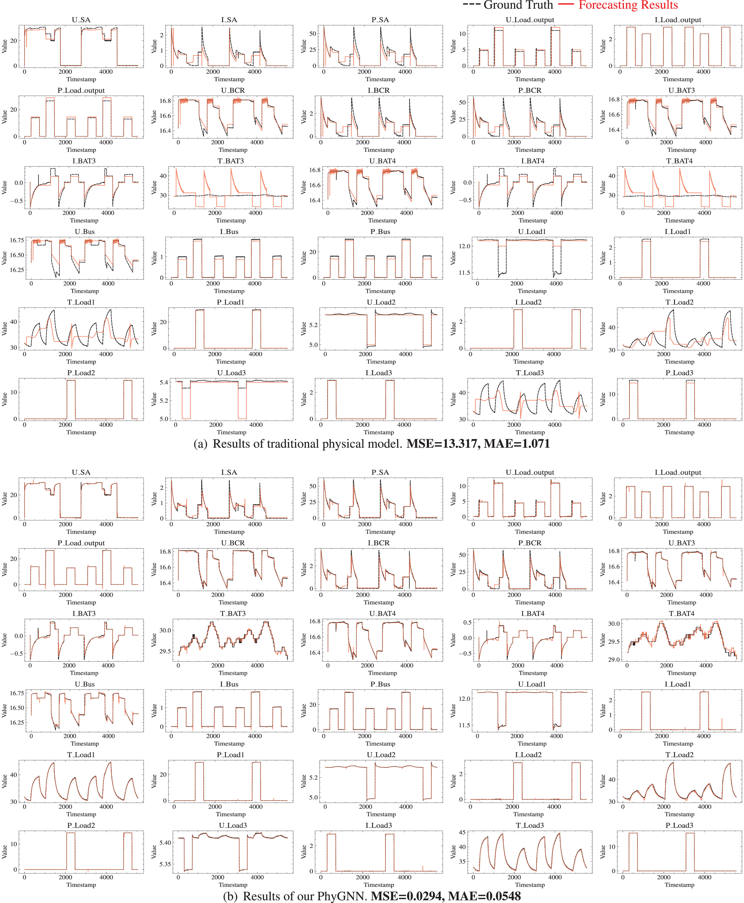

### Code, Model, Dataset of [PhyGNN: Physics guided graph neural network for complex industrial power system modeling](https://www.sciencedirect.com/science/article/pii/S0888327025010817)

if it is helpful for your research, you can cite the following paper:
```bibtex
@article{DI2025113380,
title = {PhyGNN: Physics guided graph neural network for complex industrial power system modeling},
journal = {Mechanical Systems and Signal Processing},
volume = {240},
pages = {113380},
year = {2025},
issn = {0888-3270},
doi = {https://doi.org/10.1016/j.ymssp.2025.113380},
url = {https://www.sciencedirect.com/science/article/pii/S0888327025010817},
author = {Yi Di and Fujin Wang and Zhi Zhai and Zhibin Zhao and Xuefeng Chen},
keywords = {Physics guided graph neural network, Spacecraft power system, Multivariate time series, Complex industrial system},
}
```

### Results Visualization

Results of Pure Physics Model:


Improvement of PhyGNN compared to Pure Physics Model:


Improvement of PhyGNN compared to Pure Data-driven Model:


### And we We are currently developing a more comprehensive and enhanced version of our dataset. If you are interested, welcome to follow our updates. We hope it will be helpful to you: [https://diyi1999.github.io/XJTU-SPS/](https://diyi1999.github.io/XJTU-SPS/)
